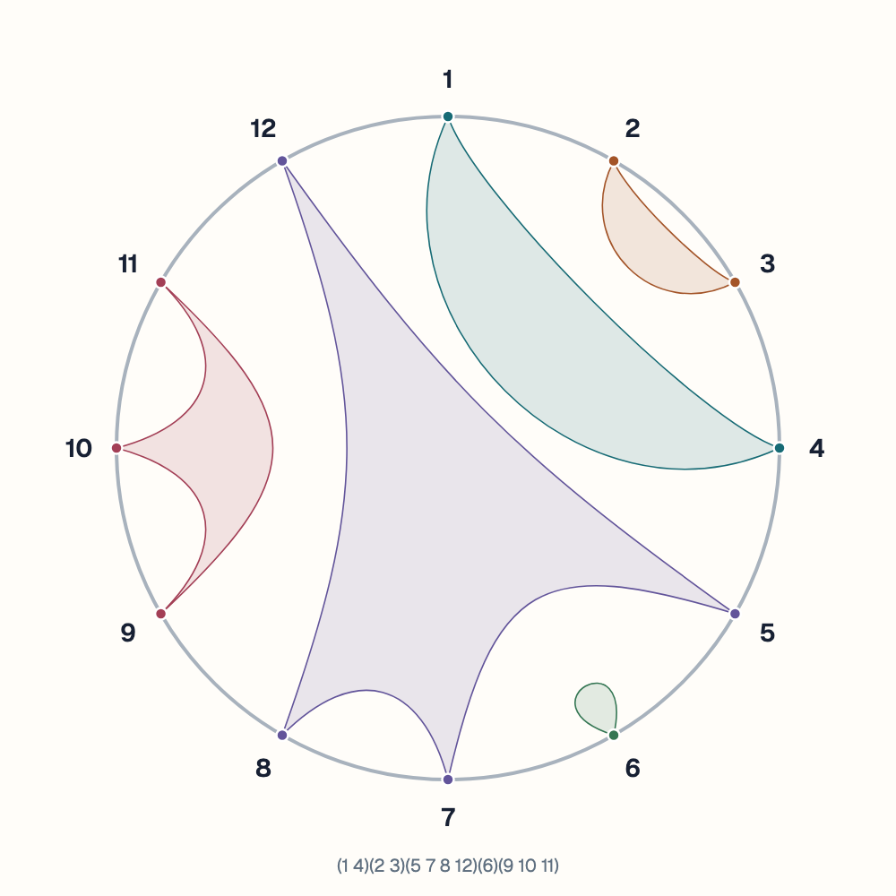
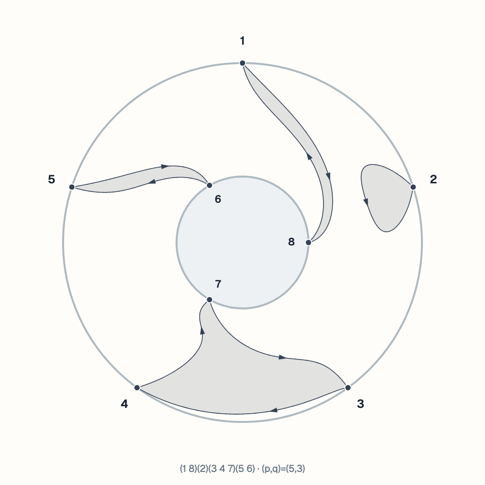

# Non-crossing Disc Partitions and Annular Permutations Generator

An interactive visualization tool for generating and exporting non-crossing disc partitions and non-crossing annular permutations.

This project helps study the combinatorics underlying free probability, and to explore/study these objects and their Kreweras complements.

Enter your own partition or permutation, or generate one at random. Inspect its Kreweras complement, adjust the diagram, and export it as an SVG for use in mathematical work.

## Examples

The following figures were generated and exported directly from the application.

| Disc partition, n = 12 | Annular permutation, (p, q) = (5, 3) |
| :---: | :---: |
| [](docs/examples/disc-nc.svg) | [](docs/examples/annular-nc.svg) |
| `(1 4)(2 3)(5 7 8 12)(6)(9 10 11)` | `(1 8)(2)(3 4 7)(5 6)` |

Select either figure to open its SVG.

## Disc input

Enter a set partition as parenthesized blocks, for example:

```text
(1 4)(2 3)(5 7 8 12)(6)(9 10 11)
```

Every label from 1 to n must occur exactly once. Order within a block does not matter: `(1 3 2)` and `(3 1 2)` represent the same block.

For the Kreweras complement, each block is read as an increasing cycle, with K(π) = π⁻¹γₙ and γₙ = (1 … n).

## Annular input

Choose p labels on the outer boundary and q on the inner boundary, then enter an oriented permutation. For (p, q) = (5, 3):

```text
(1 8)(2)(3 4 7)(5 6)
```

The outer labels are 1–5 and the inner labels are 6–8. Cycle orientation matters: `(1 2 3)` and `(1 3 2)` are different permutations. Cyclic rotations represent the same cycle, and omitted labels are fixed points.

The complement is K(τ) = τ⁻¹γ, where γ = (1 … p)(p+1 … p+q). Products act from right to left.

The optional **Canonical block set / auto-orient** mode treats the input as unordered blocks and searches for a non-crossing orientation. **Random ANC** generates a connected annular permutation; **No singleton cycles** excludes fixed points.

## Install and run

With Node.js 22.12 or later installed, run these commands from the repository folder:

```sh
cd app
npm ci
npm run dev
```

Open [localhost:5173](http://localhost:5173/) in your browser.

## Planned improvements

- A “ghost” Kreweras complement overlay.
- A grid for viewing multiple partitions or permutations at once.

## References

- **James A. Mingo and Alexandru Nica.** [*Annular non-crossing permutations and partitions, and second-order asymptotics for random matrices.*](https://arxiv.org/abs/math/0303312) International Mathematics Research Notices **2004**, no. 28, 1413–1460.
- **Philippe Biane.** [*Some properties of crossings and partitions.*](https://www.sciencedirect.com/science/article/pii/S0012365X96001392) Discrete Mathematics **175** (1997), 41–53.
